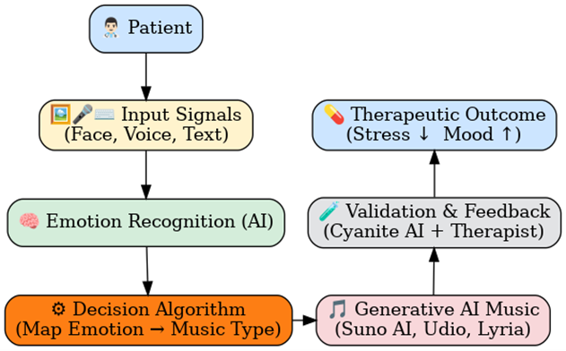

# Tuning In: Integrating Sentiment Analysis and Generative Music for Proactive Mental Health Support
This repository contains a prototype for GP8000. This project aims to integrate sentiment analysis and generative AI for real-time background music generation during therapy sessions. 

With advances in generative AI, new opportunities have emerged in healthcare, particularly in counselling practices. Our proposed approach exploits AI-driven natural language processing and sentiment analysis to detect visual and verbal cues, enabling therapists to regulate patients’ strong emotions with background music, enhance relaxation, and encourage openness.


## Methodology

The flowchart below shows the proposed method. There are four components to the method: 
1) Emotion Recognition
2) Decision Algorithm
3) Generative AI Music
4) Validation & Feedback



### Module 1: Emotion Recognition
There are two components to emotion recognition, facial sentiment analysis with computer vision and speech sentiment analysis with natural language processing.

For prototyping purposes, real-time videos will not be used. Instead, pre-recorded videos will be used for testing the emotion recognition module.


### Module 2: Decision Algorithm

### Module 3: Generative AI Music

### Module 4: Validation & Feedback


## Tutorial

### Installation
Install all requirements listed in requirements.txt using pip3 or equivalent.
```
pip install -r requirements.txt
```
### Usage
Ensure your data folder is populated with pre-recorded videos.

Run `main.py`

